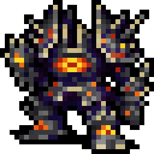
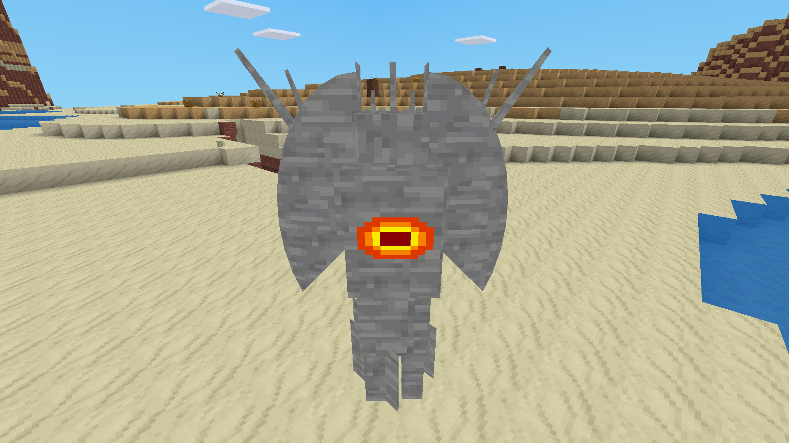

# Hell Sentinel Minetest mod

> *A towering monolith constructed and possessed by demonic forces. A
> thousand eyes leer through slits in its jagged, spiked armour.*
>
> -- Dungeon Crawl Stone Soup

Adds a fast, agile, and hard-hitting monster with damage reflection. The overall
goal is to provide a quasi-boss mob who is dangerous for players with heavy
armor, but that nonetheless won't one-shot a naked noob. If you're a
server admin, you can safely install this mob without your players putting up
Wanted posters everywhere with your name on it.

The monster, flavor (and to a lesser extent, behavior) of this monster was
inspired by the [DCSS](http://crawl.chaosforge.org/Hell_Sentinel) enemy of the
same name.

 

(Yes, the textures and mesh are horrible. If you think you can do the DCSS
sprite justice, *please* get in touch.)

**Version:** 2025-01-18

**Dependencies:** default, mobs (mobs_redo)

* © 2018-2019 Hamlet <hamlatmesehub [at] riseup [dot] net> LGPL 2.1
* © 2022-2025 fluxionary LGPL v3
* © 2025 Kiëd Llaentenn <kiedtl [at] protonmail [dot] com> LGPL v3

* Media (Textures, Models, Sounds) license:** [CC-BY-SA 3.0 Unported]
